# Ex.No.1 — FTK Imager: Forensic Imaging Tool Overview

## Volatile Memory (RAM)

**Step 1:** Run FTK Imager as Administrator
Right-click FTK Imager → Run as administrator

**Step 2:** Initiate Memory Capture
In the menu, go to File → Capture Memory...
Opens the Memory Capture dialog.

**Step 3:** Configure Destination
Destination Path: Select an external drive (never the suspect system disk).
Destination Filename: Use default or give a descriptive case-based name.

**Step 4:** Start Capture
Click Capture Memory.
Progress depends on the system’s RAM size (e.g., 8GB → few minutes).

**Step 5:** Completion
A progress bar will indicate capture status.
Once finished, a memory dump file (.mem/.bin) will be saved to the destination folder.
Note the log file generated.
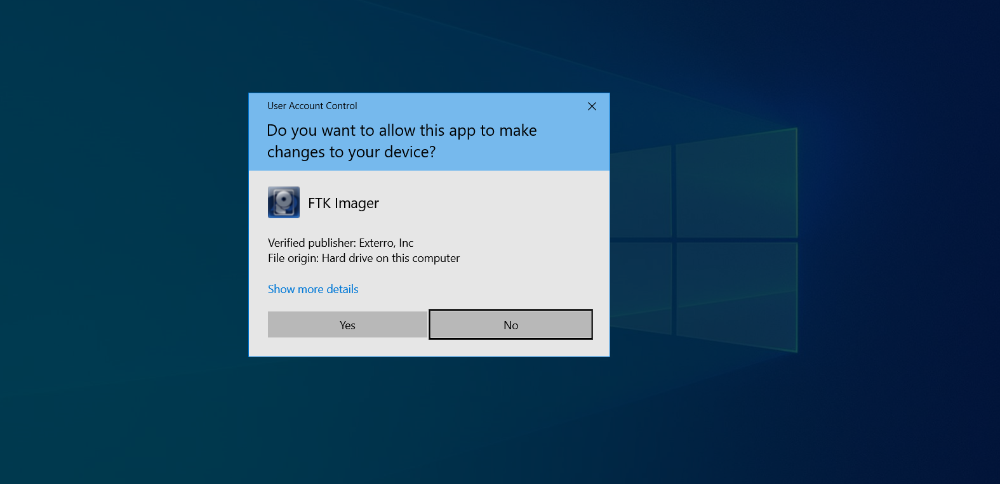
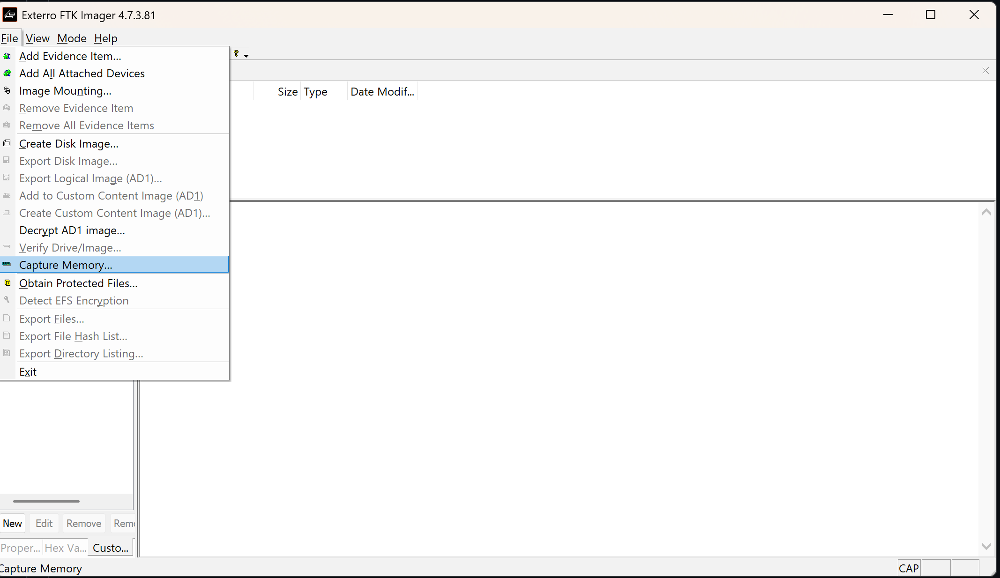
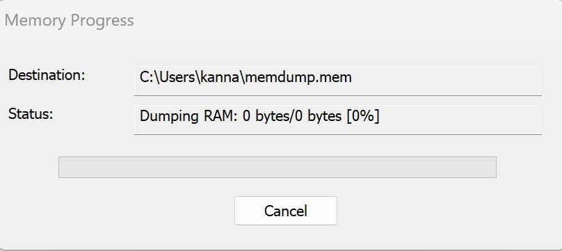
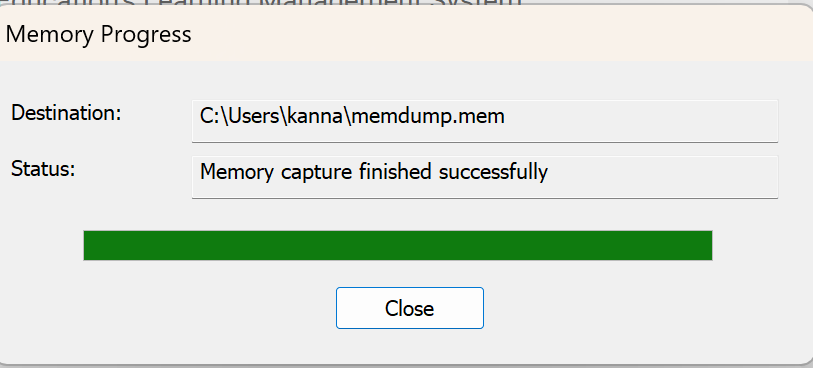

## Non-Volatile Memory (Disk Image)

**step 1:** Run FTK Imager as Administrator
Right-click the FTK Imager icon → Run as administrator
📁 Tip: Always use admin mode to ensure full disk access.

**Step 2:** Start Disk Imaging Process
In the menu bar, go to File → Create Disk Image...
Opens the “Create Image” dialog.

**Step 3:** Select Source Type
Source Type	Description
Physical Drive	Entire disk including partitions, unallocated space, and MBR
Logical Drive	Specific partition (e.g., C:)
Image File	Use if copying or converting an existing image
Folder Contents	Captures only a particular folder

**Step 4:** Select Source Drive
Connect the suspect disk through a hardware write-blocker (prevents accidental writes).
From the list of available drives, select the correct one.
Click Finish to proceed.

**Step 5:** Configure Destination
Click Add... → choose Image Type and destination path.
Image Type	Description
E01	EnCase format, compressed, includes metadata and per-segment hashes (recommended)
Raw (DD)	Bit-for-bit copy, no compression, no extra metadata
AFF	Open forensic format, supports compression
Fill in Evidence Information (Case number, examiner name, description).
Image Fragment Size:
Enter 0 → single file output
Or set a value (e.g., 2000 MB) to split into segments
Choose an external drive as Destination Path.

**Step 6:** Start Imaging
Before starting:
✅ Check Verify images after creation
✅ Check Calculate MD5/SHA1 hash
Click Start to begin imaging.
Process time depends on the drive size and speed (e.g., 1TB disk may take several hours).

**Step 7:** Completion and Hash Verification
When imaging completes, FTK Imager automatically compares the source drive hash with the image hash.
If the hashes match → evidence integrity is confirmed.
Save the acquisition log file generated by FTK Imager.

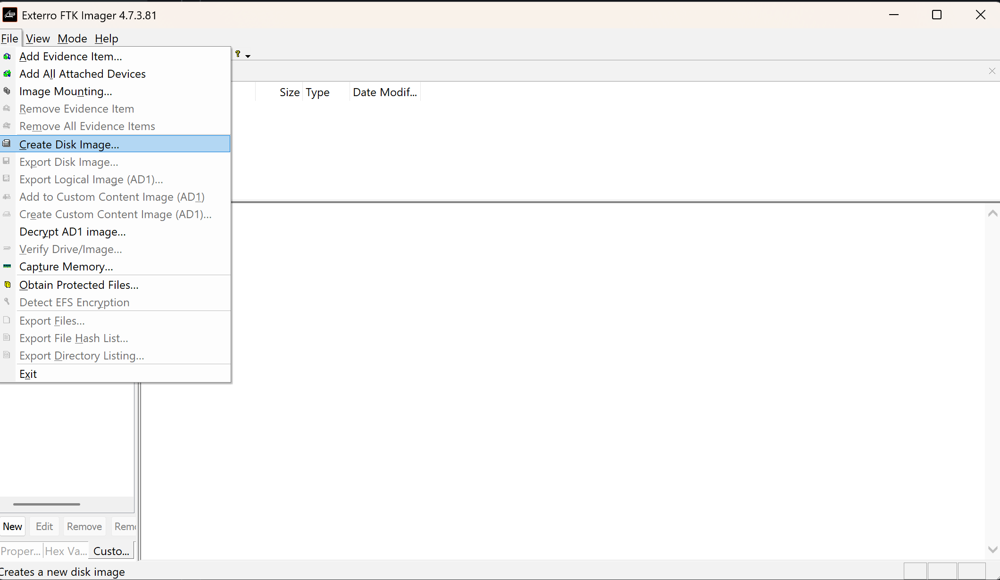
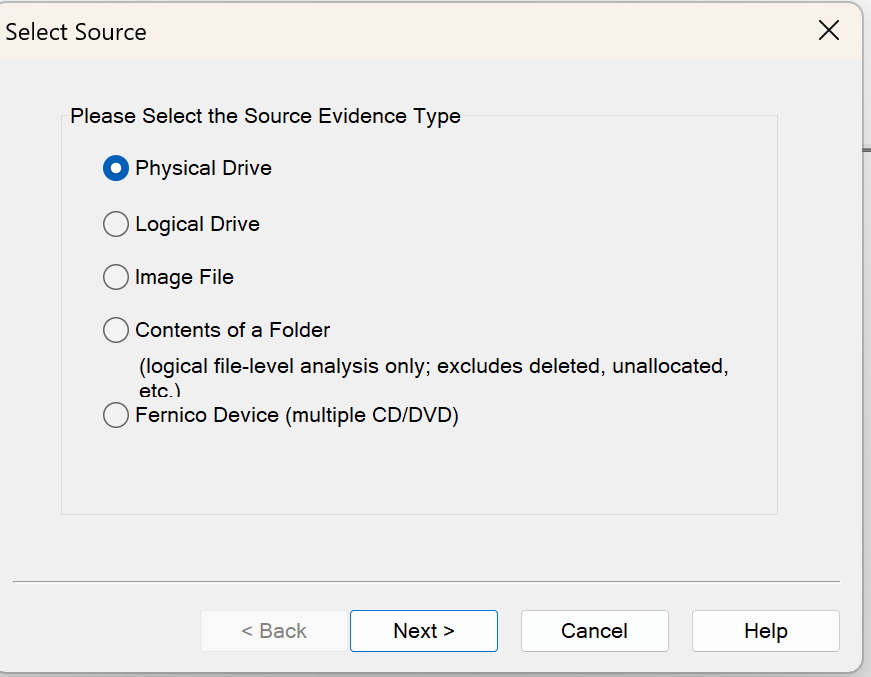
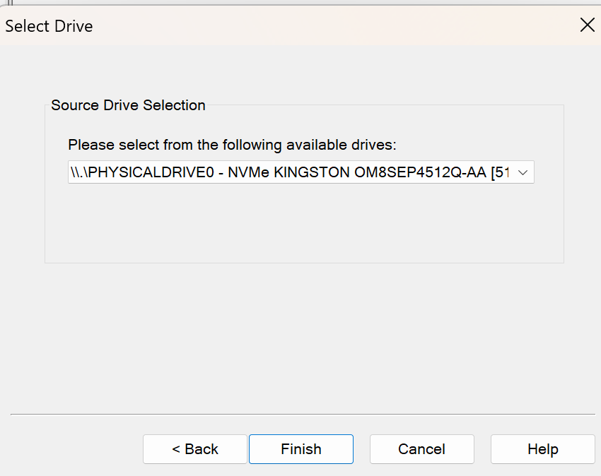
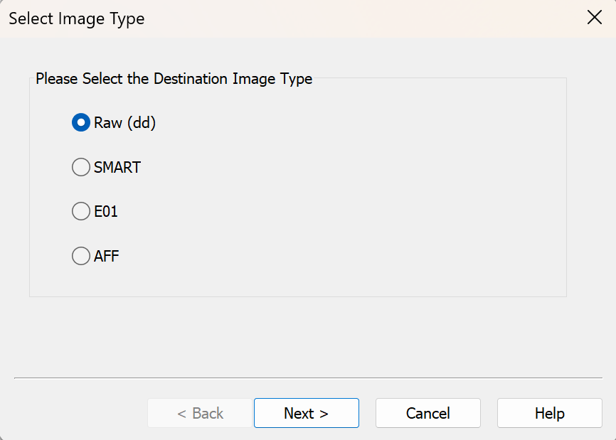
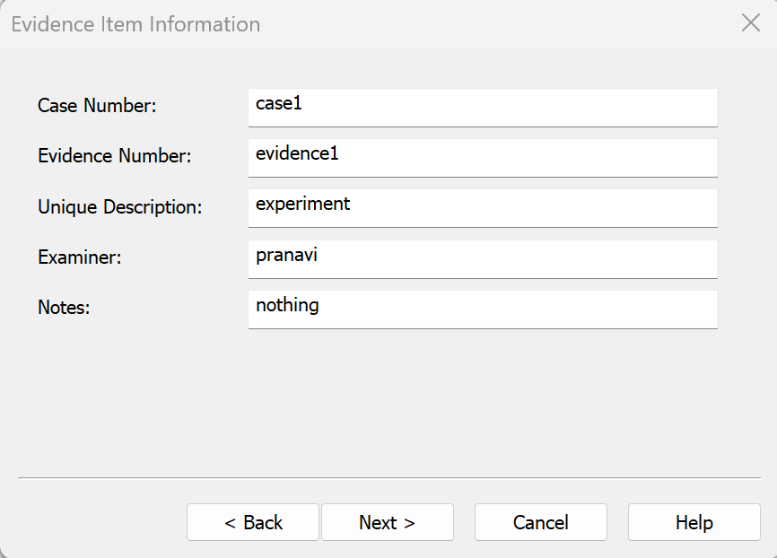
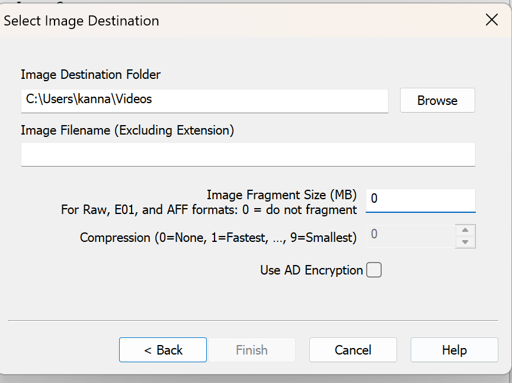
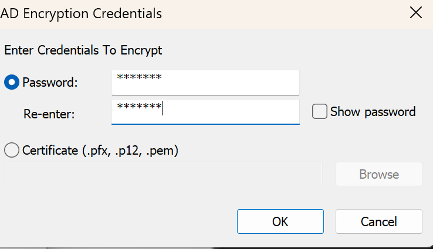
