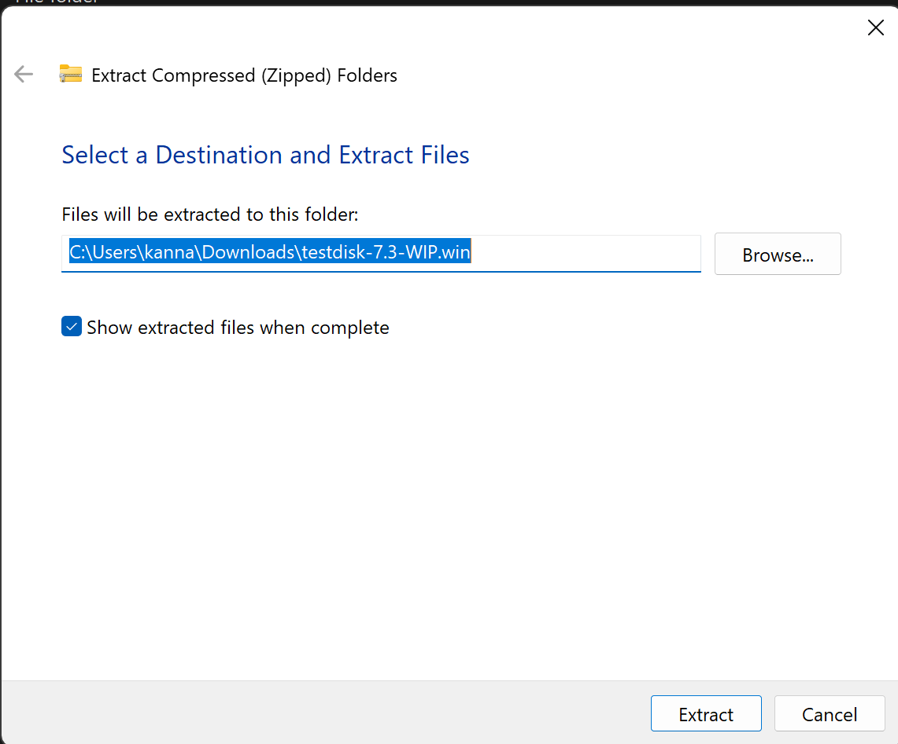
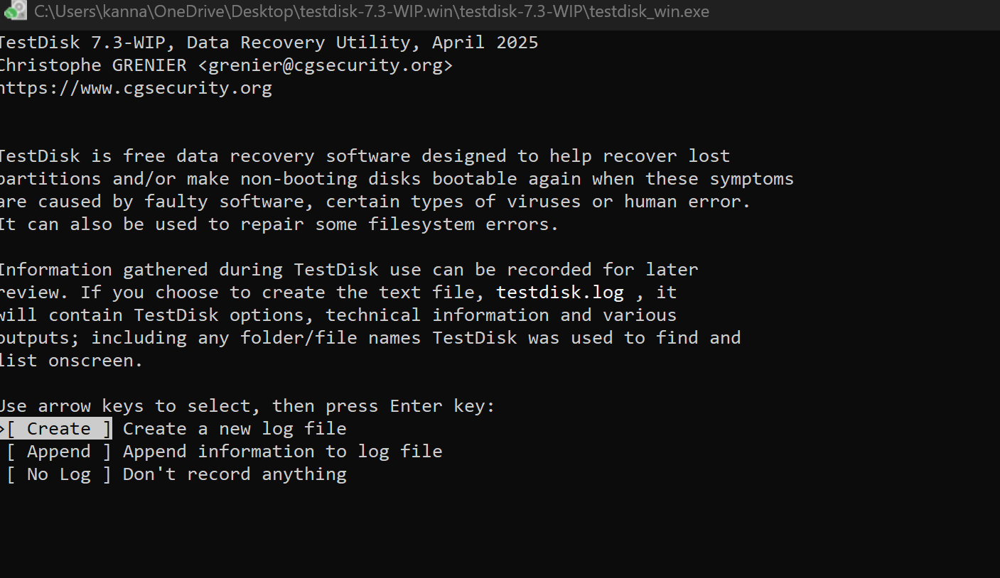
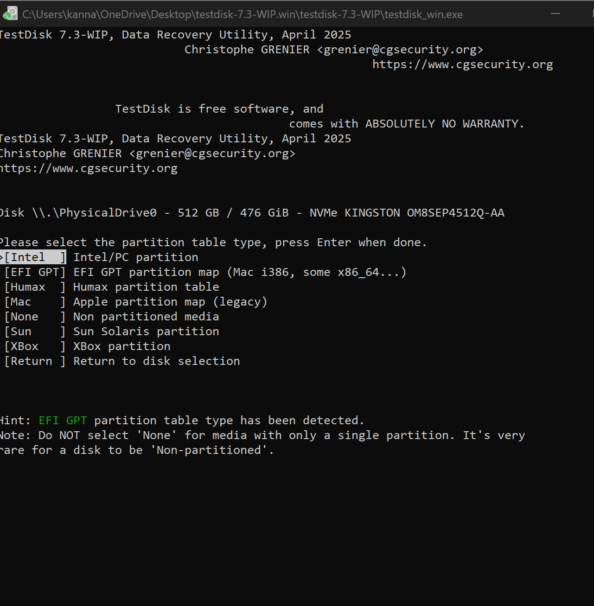
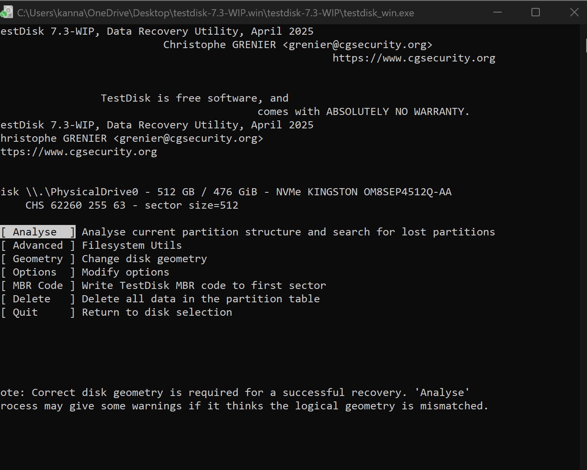
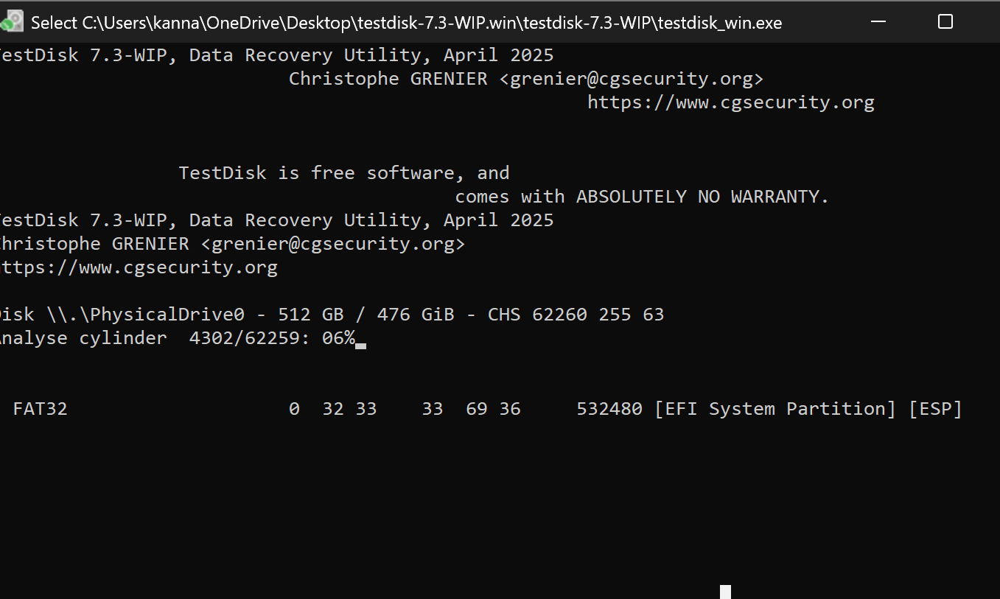

# Recovering Lost Data Using TestDisk

**Step 1:** Download and Launch TestDisk
Download TestDisk from https://www.cgsecurity.org/.
Extract the ZIP and open testdisk_win.exe (no installation needed).

**Step 2:**Create or Open Log File
Options:
Create → Create a new log file (recommended).
Append → Add to an existing log.
No Log → Skip logging.
Choose Create → Press Enter.

**Step 3:** Select the Disk to Analyze
TestDisk lists all physical drives.
Use arrow keys to select the affected disk → Press Enter.

**Step 4:** Choose Partition Table Type
Usually Intel/PC for Windows (auto-detected).
Press Enter to confirm.

**Step 5:** Analyze the Disk
Select Analyse → Press Enter.
TestDisk displays existing and deleted partitions.
Press Quick Search to find lost partitions.
If needed, press Deeper Search for more thorough scanning.

**Step 6:** Review Found Partitions
TestDisk marks partitions as:
P → Primary
* → Bootable
D → Deleted
Highlight a partition → Press P to list files.

**Step 7:** Recover Files
Use arrow keys to select files/folders.
Press C to copy.
Choose a destination folder on a different drive → Press C again to save files.

**Step 8:** Exit TestDisk
After recovery, safely exit TestDisk.
Check the copied files in the destination folder.

