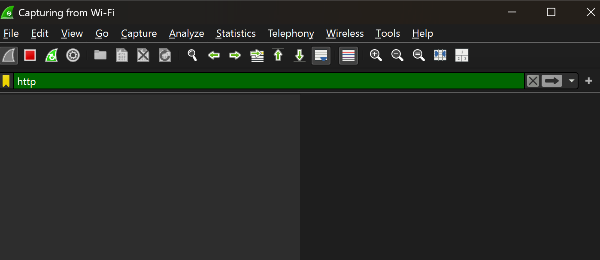

# Ex.No.3 Wireshark – Network Packet Capture and Analysis Tool

**Step 1:** Run Wireshark as Administrator
Right-click the Wireshark icon → Run as administrator

**Step 2:** Select Network Interface
Wireshark home screen shows a list of available interfaces (Wi-Fi, Ethernet, etc.).
Identify the interface connected to the network you want to monitor (e.g., Wi-Fi if using wireless).
Double-click the interface to start capture.

**Step 3:** Start Packet Capture
As soon as you start, Wireshark begins recording live packets.
The main window displays packet list, details, and hex view.
⏳ Capture runs in real time.

**Step 4:** Apply Capture/Display Filters
To reduce noise, use filters:
ip.addr == 192.168.1.10 → traffic to/from a host
http → only HTTP packets
tcp.port == 80 → traffic on port 80
Enter filters in the Display Filter bar at the top and press Enter.

**Step 5:** Stop Capture
Click the Red Square (Stop button) in the toolbar when you’ve captured enough data.

**Step 6:** Save the Capture File
Go to File → Save As…
Save with .pcapng extension (default Wireshark format).
Store on external drive or case folder for evidence.

**Step 7:** Analyze Packets
Click a packet in the top pane to see details in the middle pane.
Expand sections like Ethernet, IP, TCP/UDP, Application layer.
Follow entire conversations:
Right-click a packet → Follow → TCP Stream (shows chat, HTTP requests, etc.).

**Step 8:** Export Specific Data (Optional)
File → Export Objects → HTTP / FTP / DICOM…
Lets you extract downloaded files, images, or sessions from traffic.

