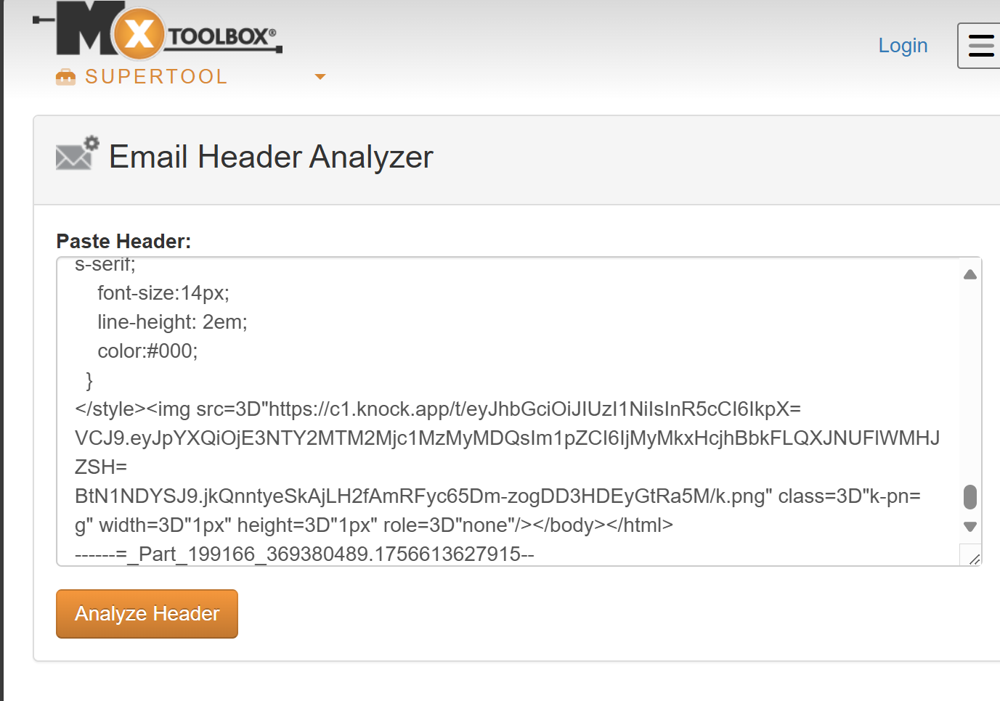

# Ex.No.4 MHA (Mail Header Analyzer)

**Step 1:** Open Mail Header Analyzer
Open a web browser.
Go to Mail Header Analyzer tool (e.g., https://mha.azurewebsites.net/
 or any other online MHA tool).

**Step 2:**
 Obtain Email Header
Open the email you want to analyze.
Find the Full Email Header (not just subject or body).
In Gmail: Click ⋮ → Show Original → Copy all text.
In Outlook: Open email → File → Properties → Internet headers → Copy all.
Copy the full header text to the clipboard.

**Step 3:** Paste Header in MHA
In the MHA tool, paste the copied header text into the input box.
Check that the entire header is pasted, including Received, From, To, Message-ID, Return-Path, etc.

**Step 4:** Analyze Header
Click Analyze or Submit.
MHA will display details such as:
Originating IP address of the sender
Email servers the email passed through (Received chain)
SPF / DKIM / DMARC authentication results
Geolocation of sender IP (if available)
Any suspicious or forged entries

**Step 5:** Interpret Results
Trace the actual source of the email using the Received headers.
Verify whether the sender is authentic using SPF/DKIM/DMARC results.

**Step 6:** Save Report
Take screenshots of the analysis or export results (if the tool allows).
Record:
Sender IP
Mail servers traversed
Authentication results
Any suspicious findings

